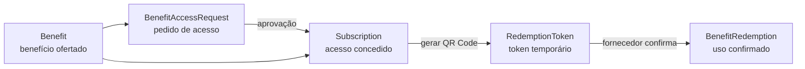
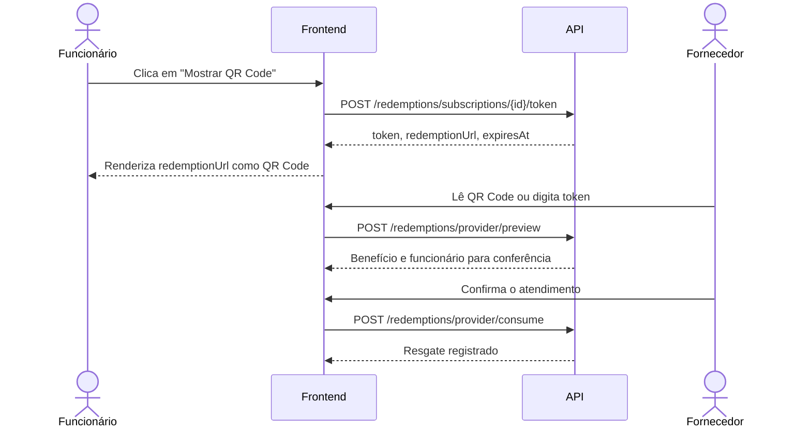

# Backend BN — guia do estado atual e plano de reorganização

> Levantamento feito em 2 de agosto de 2026. Este documento descreve o código
> como ele está; nenhuma reorganização de domínio foi aplicada.

## 1. Visão rápida

O backend é uma aplicação Quarkus reativa organizada por pacotes em
`src/main/java/org/acme/domains`. O fluxo de benefícios atualmente foi dividido
em quatro partes:

| Pacote | Responsabilidade atual |
| --- | --- |
| `benefit` | Cadastro, edição, ativação, disponibilidade e catálogo do benefício |
| `sharedbenefit` | Consultas do catálogo externo e dos benefícios já liberados ao funcionário |
| `benefitrequest` | Pedido de acesso do funcionário a benefício de outra empresa e aprovação pelo fornecedor |
| `redemption` | Emissão, validação e consumo do token temporário usado no QR Code |

`subscription` é a ligação que concede um benefício a um funcionário. É ela que
conecta a aprovação de um pedido ao resgate por QR Code.

## 2. Modelo mental do fluxo

Há dois caminhos para chegar a uma `Subscription`:

1. **Benefício da própria empresa:** ao ativar o benefício, o backend o associa
   automaticamente aos funcionários ativos da empresa. Novos funcionários
   ativos também recebem os benefícios internos ativos.
2. **Benefício de outra empresa:** o funcionário solicita acesso; o gestor da
   empresa fornecedora aprova; a aprovação cria a `Subscription`.

## 3. Onde está cada parte

### Benefício

- Entidade: `domains/benefit/Benefit.java`
- API: `domains/benefit/BenefitResource.java`
- Regras: `domains/benefit/BenefitService.java`
- Persistência: `domains/benefit/BenefitRepository.java`
- DTOs: `domains/benefit/dto/`

O benefício pertence a uma empresa fornecedora (`provider`), pode ser ativado ou
desativado, público ou oculto, ter janela de validade, categorias, termos e limite
de usos por usuário.

Importante: `CreateBenefitRequest` e `UpdateBenefitRequest`, dentro de
`benefit/dto`, são apenas DTOs HTTP para criar/editar um benefício. Eles **não**
são pedidos de acesso. O uso da palavra `Request` nos dois contextos é uma das
fontes de confusão.

### Catálogo compartilhado

- API: `domains/sharedbenefit/SharedBenefitResource.java`
- Regras: `domains/sharedbenefit/SharedBenefitService.java`
- DTO: `domains/sharedbenefit/dto/SharedBenefitResponse.java`

Endpoints:

- `GET /shared-benefits/available`: benefícios externos que o funcionário ainda
  não possui, junto com o estado do pedido de acesso.
- `GET /shared-benefits/me`: benefícios que já possuem `Subscription` e estão
  operacionais.

Esse pacote não possui entidade própria. Ele funciona como uma camada de leitura
que combina `Benefit`, `BenefitAccessRequest` e `Subscription`.

### Pedido de acesso (`benefitrequest`)

- Entidade: `domains/benefitrequest/BenefitAccessRequest.java`
- API: `domains/benefitrequest/BenefitAccessRequestResource.java`
- Regras: `domains/benefitrequest/BenefitAccessRequestService.java`
- Persistência: `domains/benefitrequest/BenefitAccessRequestRepository.java`
- DTOs: `domains/benefitrequest/dto/`

Endpoints:

- `POST /benefit-requests`: funcionário pede um benefício externo.
- `GET /benefit-requests/me`: funcionário consulta seus pedidos.
- `GET /benefit-requests/provider`: fornecedor consulta pedidos pendentes.
- `PUT /benefit-requests/{id}/approve`: fornecedor aprova e cria a
  `Subscription`.
- `PUT /benefit-requests/{id}/reject`: fornecedor rejeita o pedido.

Estados: `PENDING`, `APPROVED` e `REJECTED`.

### QR Code e resgate (`redemption`)

O backend **não gera uma imagem de QR Code**. Ele gera um token e uma URL; o
frontend transforma a URL em imagem.

Backend:

- API: `domains/redemption/RedemptionResource.java`
- Emissão e validação: `domains/redemption/RedemptionService.java`
- Token: `domains/redemption/RedemptionToken.java`
- Registro do uso: `domains/redemption/BenefitRedemption.java`
- Repositórios e DTOs: `domains/redemption/`

Frontend:

- Geração visual: `benefix-frontend/src/screens/SharedBenefitsHub.tsx`, usando
  `QRCodeSVG` de `qrcode.react`.
- Leitura pela câmera/entrada manual:
  `benefix-frontend/src/components/ProviderBenefitsConsole.tsx`, usando
  `@zxing/browser`.
- Chamadas à API: `benefix-frontend/src/services/sharedBenefitService.ts`.

Endpoints do resgate:

- `POST /redemptions/subscriptions/{subscriptionId}/token`: funcionário gera um
  token válido por 3 minutos. Um token ativo anterior da mesma assinatura é
  revogado.
- `POST /redemptions/provider/preview`: fornecedor confere token, benefício,
  funcionário e estabelecimento.
- `POST /redemptions/provider/consume`: fornecedor confirma o uso. O consumo é
  atômico e o token só pode ser usado uma vez.

O QR Code contém `redemptionUrl`, atualmente montada como
`{app.public-url}/resgatar/{token}`. O token puro também aparece abaixo do QR Code
para digitação manual. No banco é salvo apenas o SHA-256 do token.

## 4. Sequência completa do QR Code

## 5. Atualizações recentes identificadas

### 27/07/2026 — compartilhamento e resgate

Commit `2d7c512` (`feat: add shared benefit redemption flow`):

- adicionou disponibilidade pública, validade, termos e limite de usos ao
  benefício;
- criou `benefitrequest`, `sharedbenefit` e `redemption`;
- criou pedidos de acesso, tokens temporários e registros de resgate;
- adicionou os endpoints de catálogo externo, aprovação e QR Code;
- adicionou a migration `V4__shared_benefits_and_redemptions.sql`.

Foi uma alteração extensa: 34 arquivos e aproximadamente 1.236 linhas novas.

### 29/07/2026 — benefícios internos automáticos

Commit `99d4e3d` (`fix: assign company benefits to employees`):

- passou a criar `Subscription` para funcionários ativos quando um benefício da
  própria empresa é ativado;
- passou a atribuir benefícios internos ativos a novos funcionários;
- adicionou a migration `V5__assign_company_benefits_to_employees.sql` e índice
  único por funcionário/benefício.

### 31/07/2026 — robustez e integridade

Commits `9998a01` e `01d2b1e`:

- reforçaram validações de conta, funcionário, gestor e empresa ativos;
- reforçaram isolamento por empresa e regras de disponibilidade;
- tornaram o consumo do token mais seguro contra uso concorrente;
- adicionaram constraints e tratamento de duplicidades legadas na migration V6;
- ajustaram autenticação, exceções, rate limit e implantação.

## 6. Por que a organização parece fora do padrão

Separar pedido de acesso e resgate de `Benefit` pode ser uma divisão válida:
benefício é catálogo; pedido é workflow; resgate é transação e segurança. O
problema atual é menos a existência dos pacotes e mais a falta de uma linguagem e
de fronteiras explícitas:

- `benefitrequest` parece ser um DTO de `benefit`, mas é outro domínio;
- `sharedbenefit` parece uma entidade, porém é somente uma projeção de leitura;
- `Subscription` significa “acesso concedido”, nome que pode ser confundido com
  assinatura comercial;
- o QR Code não aparece em nenhum pacote chamado `qr`; ele é apenas a
  representação visual de um `RedemptionToken` no frontend;
- serviços coordenam diretamente repositórios de vários pacotes, deixando as
  dependências entre domínios implícitas;
- uma única entrega introduziu catálogo compartilhado, workflow de aprovação e
  resgate, sem documentação arquitetural junto ao código.

## 7. Plano proposto — antes de alterar código

### Fase 1 — alinhar linguagem e regras

- Confirmar o significado de `Subscription`: concessão/acesso ao benefício ou
  assinatura comercial.
- Definir os três ciclos de vida: `Benefit`, solicitação de acesso e resgate.
- Decidir se todo benefício externo exige aprovação ou se haverá concessão
  automática por parceria.
- Definir claramente quem é “cliente”, “funcionário”, “fornecedor” e “gestor”.

**Saída:** glossário e regras de negócio aprovadas.

### Fase 2 — escolher as fronteiras dos módulos

Avaliar duas opções sem mover arquivos ainda:

1. **Manter módulos separados:** renomear para conceitos explícitos, por exemplo
   `benefit`, `benefitaccess`, `benefitcatalog` e `redemption`.
2. **Agrupar por agregado de benefício:** colocar catálogo/acesso como submódulos
   de `benefit`, mantendo `redemption` separado por suas regras transacionais e
   de segurança.

**Recomendação inicial:** manter `redemption` separado; renomear
`benefitrequest` para `benefitaccess`; tratar `sharedbenefit` como query/catalog,
não como domínio. A decisão final depende do glossário da fase 1.

**Saída:** desenho de pacotes e mapa de dependências desejado.

### Fase 3 — caracterizar o comportamento atual com testes

- Cobrir solicitação, duplicidade, aprovação, rejeição e autorização do
  fornecedor.
- Cobrir emissão, expiração, revogação, preview, consumo único e concorrência do
  token.
- Cobrir limites de uso e indisponibilidade do benefício.
- Criar testes de contrato para os endpoints usados pelo frontend.

**Saída:** rede de segurança para refatoração.

### Fase 4 — refatorar em mudanças pequenas

- Renomear conceitos e pacotes em commits isolados, sem mudar comportamento.
- Extrair orquestrações entre módulos para serviços de aplicação explícitos.
- Separar DTOs HTTP, modelos de domínio e projeções de leitura de forma uniforme.
- Atualizar frontend, coleção Postman e documentação a cada contrato alterado.
- Evitar alterar migrations já aplicadas; criar novas migrations somente se o
  modelo persistido realmente mudar.

**Saída:** estrutura consistente, com histórico revisável e baixo risco.

### Fase 5 — validar e remover legado

- Executar testes unitários, integração e fluxo ponta a ponta do QR Code.
- Validar migração com uma cópia de dados que contenha duplicidades legadas.
- Remover adaptadores ou nomes antigos apenas após frontend e API estarem
  sincronizados.

**Saída:** reorganização concluída e documentada.

## 8. Decisões pendentes antes da implementação

1. `Subscription` deve continuar com esse nome?
2. O pedido pertence conceitualmente ao funcionário/benefício ou a uma parceria
   entre empresas?
3. O fornecedor aprova cada funcionário individualmente ou a empresa cliente
   deveria contratar/liberar o benefício em lote?
4. O limite `maxUsesPerUser` é total, diário, mensal ou por vigência? Hoje é total
   por `Subscription`.
5. O caminho público `/resgatar/{token}` precisa existir no frontend? Hoje o QR
   carrega essa URL, mas o console do fornecedor extrai/usa o token.
6. Benefícios ocultos (`publiclyVisible = false`) poderão ser concedidos por um
   administrador ou parceria? Hoje não entram no catálogo público.

